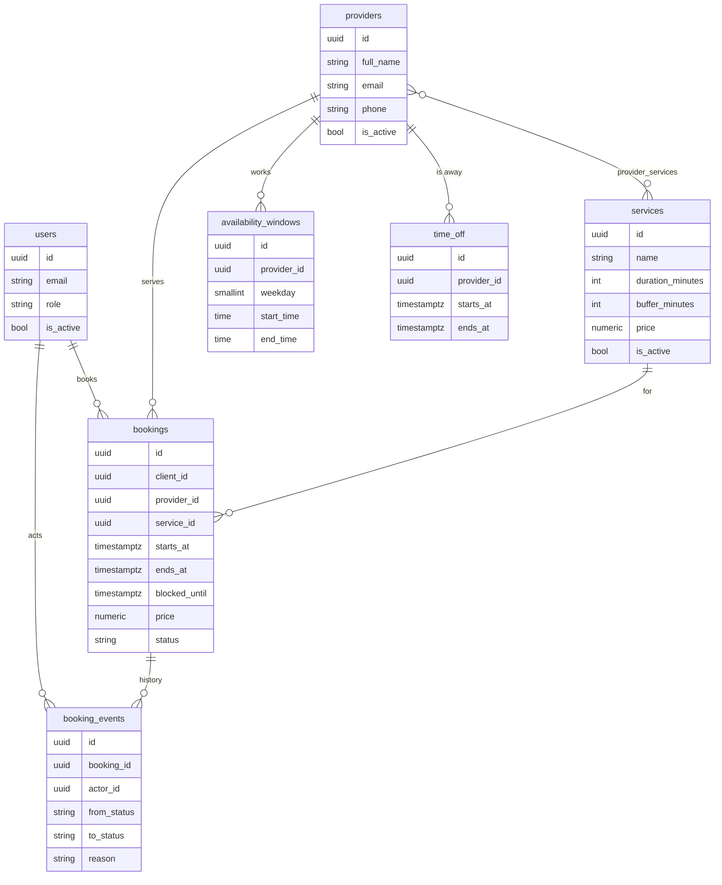

# Architecture

## Overview

```
Browser ──► nginx (web container) ──► /api/*  ──► FastAPI (api container) ──► PostgreSQL 16
              │                                        │
              └──► built React app                     └── Alembic migrations on start
```

nginx serves the React app and forwards `/api` to FastAPI, so the browser sees one origin. The login cookie therefore works without CORS, and the cookie can be `httpOnly` and `SameSite=Lax`.

## Backend layout

```
backend/app/
├── main.py                 app factory: routers, error handlers, OpenAPI operation names
├── models.py               imports every model (for Alembic and relationship lookups)
├── core/                   shared infrastructure
│   ├── config.py           settings from the environment, validated at startup
│   ├── db.py               engine, session per request
│   ├── base.py             declarative base, UUID keys, timestamps, constraint naming convention
│   ├── security.py         Argon2 password hashing, JWT create and verify
│   ├── clock.py            injectable clock (tests freeze time)
│   ├── timezone.py         business-day helpers, "+05:00" serialization
│   ├── errors.py           error types, the single error envelope, constraint-to-error mapping
│   └── schemas.py          request base (unknown fields rejected), PATCH base, page type
├── api/
│   ├── deps.py             session, clock, settings, current user, admin and client guards
│   └── router.py           mounts every feature under /api/v1
└── modules/
    ├── auth/               register, login, logout, current user
    ├── users/              user model and queries
    ├── catalog/            services
    ├── providers/          specialists and the services they offer
    ├── scheduling/         weekly hours, time off, the slot engine (domain.py)
    ├── bookings/           bookings, status rules (policies.py), history, admin views
    ├── admin/              statistics
    └── system/             /meta and /health
```

### Layers and import rules

| Layer | Does | Never does |
|---|---|---|
| `router.py` | Parses HTTP input, applies auth guards, returns response schemas | Queries, business rules, commits |
| `schemas.py` | Validates and normalizes input; shapes output | Database access |
| `service.py` | Runs a use case: locks, rules, `commit()`, error translation | Uses HTTP types |
| `repository.py` | SQLAlchemy queries, row locks, eager loading | Rules, commits |
| `domain.py`, `policies.py` | Pure functions: input in, answer out | Database, clock, settings, I/O |

- A router imports its own service and schemas.
- A service may import any repository or pure module, but never another service. This keeps the dependency graph free of cycles.
- A repository imports only models.

### Example: creating a booking

```
POST /api/v1/bookings
router.create_booking        body validated: UUIDs, start time with an offset, notes ≤ 500 characters, no extra fields
└─ BookingService.create
   ├─ UserRepository.lock(client)            SELECT ... FOR UPDATE
   ├─ ProviderRepository.lock(provider)      SELECT ... FOR UPDATE
   ├─ check: provider active, service active and offered
   ├─ load the provider's day: weekly hours for that weekday, time off, other bookings
   ├─ domain.check_start(...)                pure: grid, notice, horizon, hours, time off, taken
   ├─ check: client's upcoming-booking limit and client overlap
   ├─ insert booking (price copied, end and buffer computed by the server) and a "created" event
   └─ commit                                 exclusion constraints checked here
```

## Database



### Constraints that protect the data

| Constraint | Guarantees |
|---|---|
| `ex_bookings_provider_overlap` | No two active bookings of one specialist overlap on `[starts_at, blocked_until)` |
| `ex_bookings_client_overlap` | No two active bookings of one client overlap on `[starts_at, ends_at)` |
| `ck_services_duration_valid` | Durations are 15 to 480 minutes and on the 15-minute grid |
| `ck_availability_windows_*` | Weekday 0 to 6, end after start, times on the grid |
| `ck_bookings_blocked_after_end`, `ck_bookings_time_order` | Time ranges are well formed |
| `uq_users_email` | One account per email (stored lowercase) |
| Foreign keys from bookings | `RESTRICT`: nothing referenced by a booking can be hard-deleted |

The overlap constraints are written by hand in the migration:

```sql
ALTER TABLE bookings ADD CONSTRAINT ex_bookings_provider_overlap
EXCLUDE USING gist (
    provider_id WITH =,
    tstzrange(starts_at, blocked_until, '[)') WITH &&
) WHERE (status IN ('pending', 'confirmed'));
```

- `btree_gist` lets one GiST index combine "same specialist" (`=`) with "ranges overlap" (`&&`).
- `'[)'` makes ranges half-open, so a booking ending at 11:00 and one starting at 11:00 do not collide.
- The partial `WHERE` means cancelled and completed bookings free the slot.
- `blocked_until` is a stored column (end time plus cleanup buffer) because index expressions must be immutable, and `timestamptz + interval` is not.

Constraint names follow a naming convention, so a violation maps to a precise API error (`SLOT_TAKEN`, `CLIENT_OVERLAP`, `EMAIL_TAKEN`) instead of a 500.

## Concurrency

- **Isolation:** PostgreSQL's default, READ COMMITTED. Each statement sees a fresh snapshot, so after waiting for a lock, the next query sees what the lock holder committed.
- **Lock order:** user, then specialist, then booking, never the reverse, so transactions cannot wait on each other in a cycle.

| Operation | Locks | Why |
|---|---|---|
| Create booking | client row, then specialist row | Client limit and self-overlap; the specialist's schedule |
| Replace working hours, add or remove time off | specialist row | Checked against existing bookings |
| Deactivate specialist | specialist row | Checked for upcoming bookings |
| Confirm, cancel, complete | booking row | A cancel and a confirm cannot overwrite each other |

**Why lock the specialist row and not booking rows?** When a slot is still free, no booking row exists to lock, so two requests would both pass. The specialist row always exists.

**Why both locks and constraints?** The constraints guarantee what a database can express (no overlaps). The locks protect the rules it cannot express: working hours, time off, the per-client limit, and schedule changes that happen at the same moment as a booking.

## Time handling

- All timestamps are stored as UTC `timestamptz`. The API rejects times without an offset and returns times with the business offset (`2026-10-05T10:00:00+05:00`).
- Weekly working hours are stored as local wall-clock times (`09:00`), because that is how a business thinks about them. They are converted to UTC for a specific date.
- "Today", the booking horizon and admin date filters use the business's calendar day, not the server's UTC date.
- The frontend sends calendar dates as `YYYY-MM-DD` strings and shows every time in the business timezone.

## Frontend layout

```
frontend/src/
├── app/            providers, router (lazy routes), layout, theme
├── shared/         API client and generated types, auth hooks, datetime and money helpers, UI states
├── features/
│   ├── booking/    the wizard: service, specialist, day and time, confirm
│   ├── my-bookings/
│   ├── admin/
│   └── auth/
└── pages/          404
```

Features import from `shared` and never from each other. Server data lives only in TanStack Query. The API types are generated from the backend's OpenAPI schema (`make openapi`), so a backend change that breaks the frontend fails the TypeScript build.

## Decisions

| Decision | Reason |
|---|---|
| FastAPI | Pure API; automatic OpenAPI docs; dependency injection makes the clock and the database easy to swap in tests |
| SQLAlchemy 2.0, synchronous | Standard and well supported by Alembic; synchronous code is simpler to reason about for locking. FastAPI runs synchronous routes in a thread pool |
| Free times computed, not stored | Always consistent with hours, time off and bookings; nothing to keep in sync |
| One pure `check_start` function | Listing slots and booking use the same rule, with a precise reason when a time is not bookable |
| Database constraints plus locks | Constraints are the guarantee; locks protect rules a constraint cannot express |
| Status changes as action endpoints | Each action has its own rules; `POST /admin/bookings/{id}/confirm` reads better than a generic status update |
| `allowed_actions` in responses | The frontend never duplicates the cancellation and status rules |
| Admin endpoints under `/admin` | One response shape per endpoint: public views hide contacts and inactive items; admin views show everything |
| Soft delete for services and specialists | Bookings keep valid references; items can be reactivated |
| Schedule changes refused when they strand bookings | A client's booking is never silently orphaned; the admin decides what to do |
| Cookie auth, same origin | The token is invisible to JavaScript, and there is no CORS configuration to get wrong |
| 15-minute grid as a constant, not a setting | The database CHECK constraints depend on it; making it configurable would let the two disagree |
